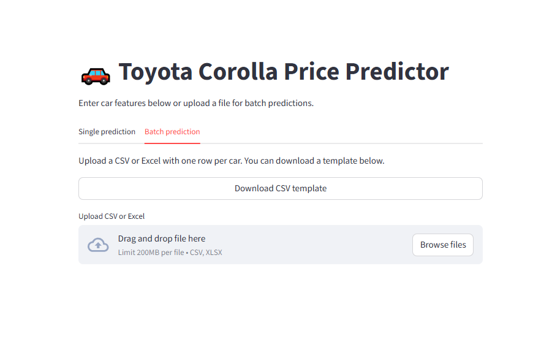

# 🚗 Toyota Corolla Price Predictor

An **end-to-end, full-stack machine learning application** for predicting Toyota Corolla prices based on vehicle attributes.  
It combines rigorous data cleaning, robust regression modeling, SHAP-based interpretability, and a user-friendly interface — all fully containerized for reproducible deployment.

---

## 🔧 Features

- 📈 Predicts car prices from user inputs (mileage, age, engine, doors, fuel type, etc.)
- 🗂️ Supports batch prediction via CSV upload
- 🧠 SHAP explanations for model transparency
- 🌐 FastAPI backend with Swagger docs
- 🖥️ Streamlit frontend for interactive use
- 🐳 Docker + docker-compose for seamless deployment

---

## 📦 Tech Stack

- Python 3.10  
- FastAPI + Uvicorn  
- Streamlit  
- scikit-learn  
- SHAP  
- Docker + docker-compose  

---

## 📂 Project Structure

Toyota_Corolla_Price_Predictor/  

├── **app.py**    # FastAPI backend 

├── **streamlit_app.py** # Streamlit frontend 

├── **car_price_pipeline.pkl** # Final trained model 

├── **requirements.txt**

├── **Dockerfile** 

├── **docker-compose.yml** 

└── **README.md**


---

## ⚙️ How It Works

This app combines data science best practices with full-stack deployment to deliver accurate, interpretable car price predictions.

### 🔄 Workflow Overview

```
graph TD
    A[Raw Dataset] --> B[Data Cleaning & Feature Engineering]
    B --> C[Model Training (OLS, Ridge, RF, GB)]
    C --> D[SHAP Interpretation]
    D --> E[FastAPI Backend]
    E --> F[Streamlit Frontend]
    F --> G[User Input / CSV Upload]
    G --> H[Predicted Price Output]
```
## 📊 SHAP Explanation
SHAP values are used to explain how each feature contributes to a specific prediction. For example:

Age_08_04 and KM tend to decrease the predicted price.

HP, CC, and Weight often increase it.

SHAP plots help visualize these effects for both individual and global predictions.


## 🚀 Quick Start (Docker)
### 1️⃣ Clone the repo
```
git clone https://github.com/souhila21/toyota-corolla-price-predictor.git
cd toyota-corolla-price-predictor
```
### 2️⃣ Build and run with Docker Compose
```
docker-compose up --build
```
FastAPI: http://localhost:8000/docs

Streamlit: http://localhost:8501

If ports are busy, update docker-compose.yml to use alternate ports (e.g., 8002, 8502).

## 📊 Usage
🔹 Single Prediction
Enter car features manually in the Streamlit UI and click Predict price.

🔹 Batch Prediction
Upload a CSV file with multiple rows of car features. The app returns predicted prices in a table.

Example input format:
```
Age_08_04,KM,HP,CC,Doors,Gears,Weight,Quarterly_Tax,Fuel_Type,Color,Model
40,3000,92,1600,5,5,1070,100,Petrol,Black,Other
```
📄 Download CSV Template

## 📂 API Endpoints
POST /predict: Single prediction

POST /predict_batch: Batch prediction

GET /ping: Health check

See full docs at http://localhost:8000/docs

## 🖼️ Screenshot
**Single Prediction Interface**  


**Batch Prediction Interface**  


## 🙌 Credits
Built by SOUHILA ACIL.

Model trained and deployed with reproducibility, interpretability, and usability in mind.